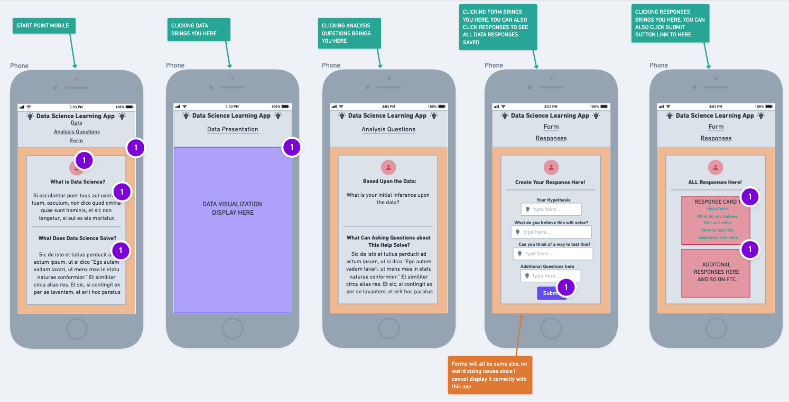
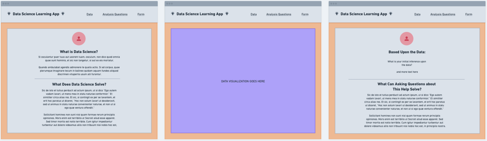
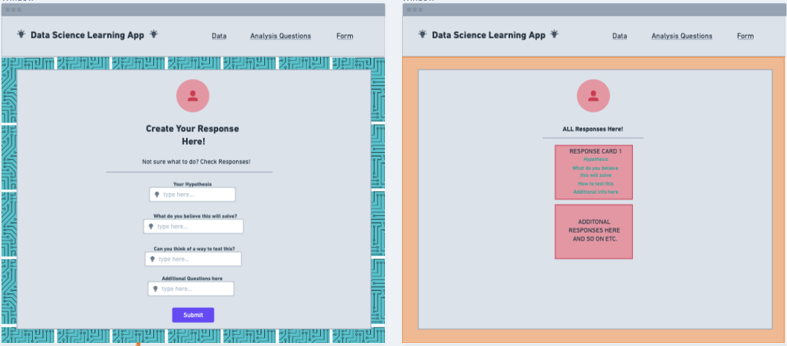
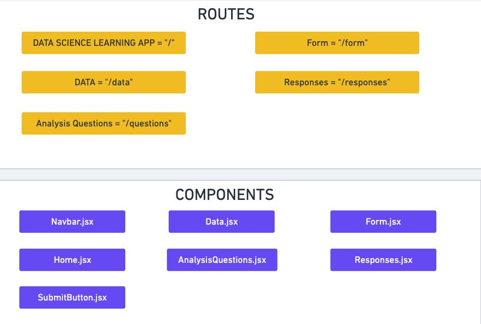
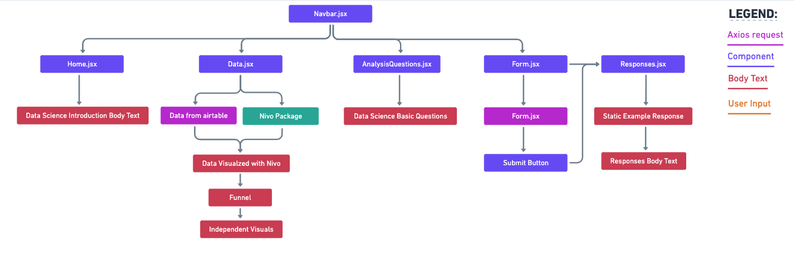

# Project Overview

## Project Name

Data Science Learning App

## Project Description

Introductory Data Science application that lets you interact with the basics fundamentals of what data science is and what it can accomplish. Let the user interact with a data set, make assumptions, write those assumptions, and finally display those against other users responses. Using responses to promote a growth mindset and very beginner friendly approach.

## Wireframes

https://whimsical.com/data-science-learning-app-NkwC1Bo3o4LVdUQpzjG6yD







## Component Hierarchy

https://whimsical.com/data-science-learning-app-NkwC1Bo3o4LVdUQpzjG6yD





## API and Data Sample

```json
{
  "records": [
    {
      "id": "recONRzIUTuZ5lXaF",
      "fields": {
        "author": "Liz Yrineo",
        "setup": "Why did the tomato turn red?",
        "punchline": "Because it saw the salad dressing!"
      },
      "createdTime": "2020-11-30T16:03:09.000Z"
    },
    {
      "id": "rec3oYZ5Tp0AIDsKe",
      "fields": {
        "author": "Rachel Moskowitz",
        "setup": "What did the green grape say to the red grape?",
        "punchline": "Breathe, idiot, breathe!"
      },
      "createdTime": "2020-11-30T16:03:09.000Z"
    },
    {
      "id": "recA34tOaoE1IVeC1",
      "fields": {
        "author": "Gary Grant",
        "setup": "How do you make holy water?",
        "punchline": "You boil the hell out of it!"
      },
      "createdTime": "2020-11-30T16:03:09.000Z"
    }
  ],
  "offset": "recA34tOaoE1IVeC1"
}
```

#### MVP

- Introductory to data science home page
- Data visual on page
- Analysis questions on page
- Form input
- Form results

#### PostMVP

- Create additional visuals to scroll through
- Create additional questions and scale up form
- Add additional learning resources page to link to

## Project Schedule

This schedule will be used to keep track of your progress throughout the week and align with our expectations. Here's an example.

| Day        | Deliverable                                        | Status     |
| ---------- | -------------------------------------------------- | ---------- |
| July 10-12 | Prompt / Wireframes / Priority Matrix / Timeframes | Incomplete |
| July 13    | Project Approval                                   | Incomplete |
| July 13    | Core Application Structure (HTML, CSS, etc.)       | Incomplete |
| July 14    | Pseudocode / actual code                           | Incomplete |
| July 15    | Initial Clickable Model                            | Incomplete |
| July 16    | MVP                                                | Incomplete |
| July 17    | Presentations                                      | Incomplete |

## Timeframes

Tell us how long you anticipate spending on each area of development. Be sure to consider how many hours a day you plan to be coding and how many days you have available until presentation day.

Time frames are also key in the development cycle. You have limited time to code all parts of your app. Your estimates can then be used to evalute possibilities based on time needed and the actual time you have before the app must be submitted. It's always best to pad the time by a few hours so that you account for the unknown so add an additional hour or two to each component to play it safe. Throughout your project, keep track of your Time Invested and Actual Time and update your README regularly.

| Component        | Priority | Estimated Time | Time Invested | Actual Time |
| ---------------- | :------: | :------------: | :-----------: | :---------: |
| Adding Form      |    H     |      3hrs      |    3.5hrs     |   3.5hrs    |
| Working with API |    H     |      3hrs      |    2.5hrs     |   2.5hrs    |
| Total            |    H     |      6hrs      |     5hrs      |    5hrs     |

## SWOT Analysis

### Strengths:

### Weaknesses:

### Opportunities:

### Threats:
